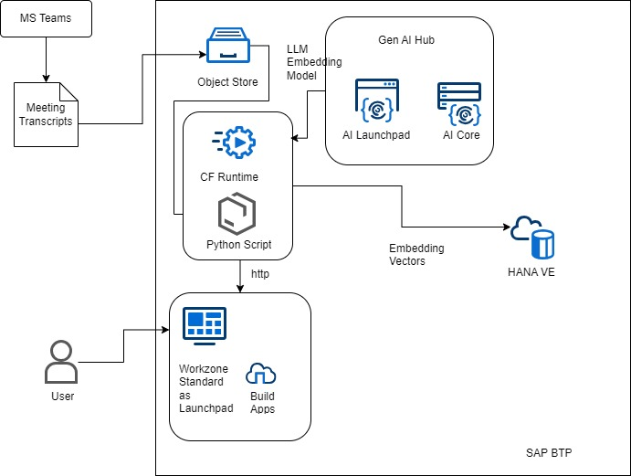
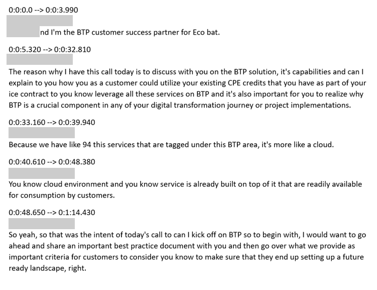
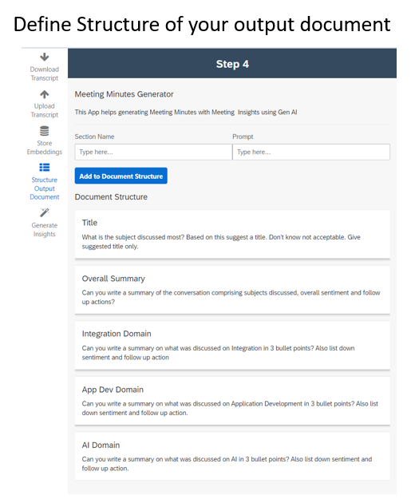
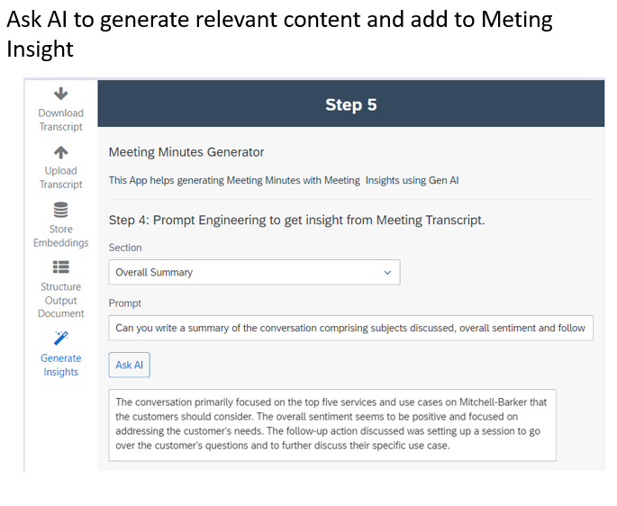
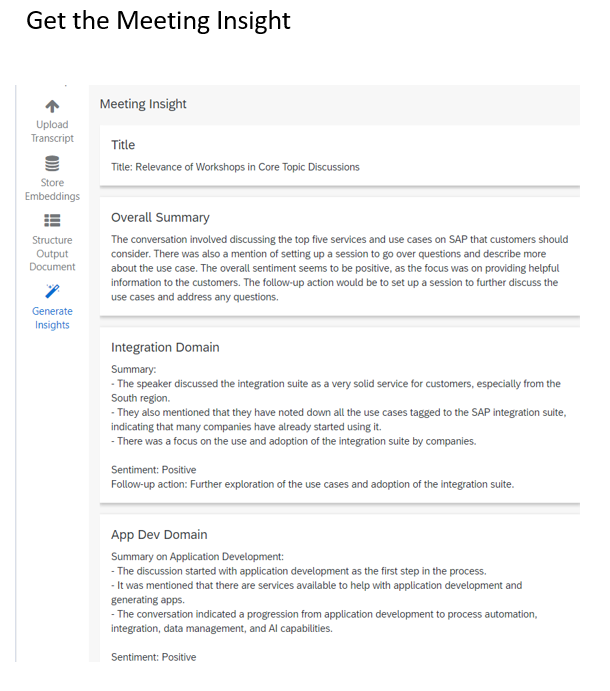

# Gen AI Powered Meeting Minute Generator 
## About this application

MoMGen is a tool that helps you analyze meeting transcripts and prepare structured documents within minutes.
Typically, when you have web meetings using MS Teams or Zoom, you can turn on the meeting transcripts which keeps track of the conversations and provides detailed dialogs based on time stamp. However, it is often difficult to review those transcripts and make a meaningful summary.

Modern tools like MS Copilot comes up with meeting summary options. However, that never comes up with summary with intended purpose.
To make a meaningful and insightful meeting minutes you need to understand the context and intent behind the meeting and structure your output document accordingly.

MoMGen does this exactly. It allows you to create a structure of the output document based on your need and allow Gen AI to fill out the different sections based on your intent.

This application is a demo app that shows the power of SAP's Business AI offering - where Retrieval Augmented Generation (RAG) architecture is implemented using SAP BTP services. LLM and embeddings are used from SAP BTP AI Core and vector embeddings are stored on SAP HANA Cloud Vector Engine. The service layer is built on LangChain using SAP AI Core proxy that gives flexibility to chose the LLM model. By default GPT3.5 is chosen. The UX is developed using SAP Build Apps - LCNC platform and the app is deployed on SAP BTP Cloud Foundry environment. The app can be accessed securely via the SAP Build Workzone Standard launchpad.

## How to run
App can be accessed via the following URL:
https://rise-setup-sh397zlr.launchpad.cfapps.us10.hana.ondemand.com/site?siteId=c8a7c371-da6a-45a5-94e5-a386e89311e1#buildapps67575-open?sap-ui-app-id-hint=saas_approuter_buildapps67575

Please contact: shibaji.chandra@sap.com if you need access.

## Architecture
The App is stacked on 3 Tier Architecture. The core is dependdent on SAP BTP AI Core services and HANA Cloud Vector Engine. On top of that there is a service API layer built on SAP BTP Cloud Foundry based on Python buildpack using LangChain libraries. Last but on the least the UX layer was built using SAP Build Apps - Low code No code platform and deployed on SAP Build Workzone for role based access.

The following diagram shows the architecture diagram:

## Environment Setup
For this app there are number of BTP Services used. Prerequisite services to be enabled are:
* SAP AI Core
* SAP AI Launchpad
* SAP HANA Cloud
* SAP HANA Vector Engine (with tools option)
* Cloud Foundtry runtime
* SAP Build Apps
* SAP Workzone Standard
* SAP Identity Authentication

For the AI Core and HANA VE setup you can refer to the link below to utilize the automated setup using terraform script.
https://github.tools.sap/btp-ai/genai-starter-kit

## Deployment Dependency
The App is using Python build pack. Please refer to the  [requirements.txt](requirements.txt) to get more details.

## Deployment Sequence
1. First setup environment for AI Core and HANA VE using the stater kit (link given above)
2. Enable Cloud Foundry environment.
3. Then, deploy the Python app on Cloud Foundry environment
4. Test out the API endpoints that the Python App is exposing. You can use the [POSTMAN Collection](testing/MOM-RAG.postman_collection.json) to test the APIs
5. Setup destination to expose the API. Sample destination can be configured using [Sample Destination File](config/RAG)
6. Deploy the Build App using the MTAR. Please use command line: cf deploy <your MTAR file name>.mtar
    - Sample MTAR for the build Apps is given [Sample UX Build App Deployable](UX/app-67575_web_build-5561.mtar)
    - Refer to Help link for Build Apps deployment: https://help.sap.com/docs/build-apps/service-guide/build-and-deploy-web-applications
7. Setup IAS connectivity between Build App and Build Workzone. Please refer to help link : here https://help.sap.com/docs/build-apps/service-guide/integration-to-app-builder#deployed-applications and deploy the app to SAP Build Workzone.

## Use Case Flow
1. Turn on Meeting Transcript on your web meetings like MS Teams or Zoom.
2. Typically the transcripts are comprising of each dialogue with time-stamp and looks like following:

This is cumbersome to compile meeting insights and summary from such document.
3. With MoMGen - you can flexibly define document structure.

4. Ask AI to fill out the section based on the meeting context.

5. Get high quality meeting insights.

